# Stripe Connect User Authentication Guide

> A detailed guide on `disable_stripe_user_authentication` feature, Account Sessions vs Account Links, and how to configure authentication for your Connect platform.

---

## Executive Summary

Stripe Connect provides two primary ways to give connected accounts access to Stripe functionality:

1. **Account Sessions** - Powers embedded components in your own website/app
2. **Account Links** - Redirects users to Stripe-hosted pages

The `disable_stripe_user_authentication` feature is **only available with Account Sessions** and allows you to bypass Stripe's authentication popup, providing a seamless experience when your platform already handles user authentication.

---

## Quick Comparison

```mermaid
flowchart TB
    subgraph AccountSessions["Account Sessions (Embedded Components)"]
        AS1["✅ Full dashboard functionality"]
        AS2["✅ disable_stripe_user_authentication available"]
        AS3["✅ Stays in your app/website"]
        AS4["✅ All 25 component types"]
        AS5["✅ Custom styling/theming"]
    end
    
    subgraph AccountLinks["Account Links"]
        AL1["⚠️ Only onboarding/update flows"]
        AL2["❌ No disable_stripe_user_authentication"]
        AL3["❌ Redirects to Stripe pages"]
        AL4["⚠️ 2 types only"]
        AL5["❌ Stripe's styling"]
    end
    
    style AccountSessions fill:#e8f5e9
    style AccountLinks fill:#fff3e0
```



| Feature | Account Sessions | Account Links |
|:--------|:-----------------|:--------------|
| **API Endpoint** | `POST /v1/account_sessions` | `POST /v1/account_links` |
| **Purpose** | Embed Stripe UI in your app | Redirect to Stripe-hosted pages |
| **Result** | `client_secret` for Connect.js | `url` to redirect user |
| **Dashboard Viewing** | ✅ Full support | ❌ Not supported |
| **disable_stripe_user_authentication** | ✅ **Available** | ❌ **Not Available** |
| **Component Types** | 25+ embedded components | 2 types only |
| **User Experience** | Seamless, stays in your app | Leaves your app to Stripe |
| **Customization** | Full CSS/theming control | Stripe's default styling |

---

## The Authentication Challenge

### Default Behavior (Without disabling auth)

When using embedded components like Payments, Payouts, or Account Management, Stripe may prompt connected account users to **authenticate with Stripe** before accessing sensitive functionality. This creates friction:


### With `disable_stripe_user_authentication: true`


---

## Understanding `disable_stripe_user_authentication`

### What It Does

When set to `true`, this feature:
- ✅ Skips Stripe's authentication popup for the connected account user
- ✅ Allows immediate access to sensitive components (payouts, account settings, etc.)
- ✅ Relies on **your platform's authentication** instead
- ✅ Provides a seamless embedded experience

### Requirements to Enable

You can **only** use `disable_stripe_user_authentication: true` if:

| Requirement | Details |
|:------------|:--------|
| **Account Type** | Custom accounts (or accounts where platform collects requirements) |
| **Controller Setting** | `controller.requirement_collection` must be `application` |
| **API Version** | `2024-10-28.acacia` or later (current: `2025-11-17.clover`) |
| **Your Responsibility** | Platform assumes liability for connected accounts |

### Components That Support This Feature

Based on the Stripe API response, the following components support `disable_stripe_user_authentication`:

| Component | Supports `disable_stripe_user_authentication` | Notes |
|:----------|:---------------------------------------------|:------|
| `account_management` | ✅ Yes | View/edit account details |
| `account_onboarding` | ✅ Yes | Onboarding flow |
| `balances` | ✅ Yes | Balance display + payout features |
| `payouts` | ✅ Yes | Payouts dashboard |
| `notification_banner` | ✅ Yes | Pending actions banner |
| `financial_account` | ✅ Yes | Treasury financial account |
| `issuing_cards_list` | ✅ Yes | List of issued cards |
| `instant_payouts_promotion` | ✅ Yes | Instant payouts promotion |
| `payments` | ❌ No | No auth required for viewing |
| `payment_details` | ❌ No | No auth required for viewing |
| `disputes_list` | ❌ No | No auth required for viewing |
| `payouts_list` | ❌ No | No auth required for viewing |
| `payout_details` | ❌ No | No auth required for viewing |
| `documents` | ❌ No | No auth required for viewing |
| `tax_registrations` | ❌ No | No auth required for viewing |
| `tax_settings` | ❌ No | No auth required for viewing |

> [!NOTE]
> Components marked with ❌ don't require Stripe user authentication by default, so there's no need for the `disable_stripe_user_authentication` feature.

---

## Implementation

### 1. Creating a Connected Account with Proper Settings

For `disable_stripe_user_authentication` to work, the connected account must be created with the platform responsible for requirements:

```bash
curl https://api.stripe.com/v1/accounts \
  -u "sk_test_xxx:" \
  -d type=custom \
  -d country=US \
  -d "capabilities[card_payments][requested]=true" \
  -d "capabilities[transfers][requested]=true" \
  -d "controller[requirement_collection]=application" \
  -d "controller[stripe_dashboard][type]=none"
```

**TypeScript Example:**

```typescript
import Stripe from 'stripe';

const stripe = new Stripe(process.env.STRIPE_SECRET_KEY!);

async function createConnectedAccountForDisabledAuth() {
  const account = await stripe.accounts.create({
    type: 'custom',
    country: 'US',
    capabilities: {
      card_payments: { requested: true },
      transfers: { requested: true },
    },
    controller: {
      requirement_collection: 'application', // Platform collects requirements
      stripe_dashboard: {
        type: 'none', // No direct Stripe Dashboard access
      },
    },
  });

  console.log('Created account:', account.id);
  return account;
}
```

Key parameters:
- `type: 'custom'` - Custom account type
- `controller.requirement_collection: 'application'` - **Your platform** collects requirements
- `controller.stripe_dashboard.type: 'none'` - Account cannot access Stripe Dashboard directly

### 2. Creating an Account Session with Disabled Auth

```bash
curl https://api.stripe.com/v1/account_sessions \
  -u "sk_test_xxx:" \
  -d account=acct_xxxxxxxxxxxxx \
  -d "components[payments][enabled]=true" \
  -d "components[payments][features][refund_management]=true" \
  -d "components[payments][features][dispute_management]=true" \
  -d "components[payments][features][capture_payments]=true" \
  -d "components[payouts][enabled]=true" \
  -d "components[payouts][features][instant_payouts]=true" \
  -d "components[payouts][features][standard_payouts]=true" \
  -d "components[payouts][features][edit_payout_schedule]=true" \
  -d "components[payouts][features][external_account_collection]=true" \
  -d "components[payouts][features][disable_stripe_user_authentication]=true" \
  -d "components[account_management][enabled]=true" \
  -d "components[account_management][features][external_account_collection]=true" \
  -d "components[account_management][features][disable_stripe_user_authentication]=true" \
  -d "components[balances][enabled]=true" \
  -d "components[balances][features][instant_payouts]=true" \
  -d "components[balances][features][standard_payouts]=true" \
  -d "components[balances][features][edit_payout_schedule]=true" \
  -d "components[balances][features][external_account_collection]=true" \
  -d "components[balances][features][disable_stripe_user_authentication]=true" \
  -d "components[notification_banner][enabled]=true" \
  -d "components[notification_banner][features][external_account_collection]=true" \
  -d "components[notification_banner][features][disable_stripe_user_authentication]=true" \
  -d "components[account_onboarding][enabled]=true" \
  -d "components[account_onboarding][features][external_account_collection]=true" \
  -d "components[account_onboarding][features][disable_stripe_user_authentication]=true"
```

### 3. Node.js/TypeScript Example

```typescript
import Stripe from 'stripe';

const stripe = new Stripe(process.env.STRIPE_SECRET_KEY!);

async function createAccountSessionWithDisabledAuth(accountId: string) {
  const accountSession = await stripe.accountSessions.create({
    account: accountId,
    components: {
      payments: {
        enabled: true,
        features: {
          refund_management: true,
          dispute_management: true,
          capture_payments: true,
        },
      },
      payouts: {
        enabled: true,
        features: {
          instant_payouts: true,
          standard_payouts: true,
          edit_payout_schedule: true,
          external_account_collection: true,
          disable_stripe_user_authentication: true, // 👈 Disable auth
        },
      },
      account_management: {
        enabled: true,
        features: {
          external_account_collection: true,
          disable_stripe_user_authentication: true, // 👈 Disable auth
        },
      },
      balances: {
        enabled: true,
        features: {
          instant_payouts: true,
          standard_payouts: true,
          edit_payout_schedule: true,
          external_account_collection: true,
          disable_stripe_user_authentication: true, // 👈 Disable auth
        },
      },
      notification_banner: {
        enabled: true,
        features: {
          external_account_collection: true,
          disable_stripe_user_authentication: true, // 👈 Disable auth
        },
      },
      account_onboarding: {
        enabled: true,
        features: {
          external_account_collection: true,
          disable_stripe_user_authentication: true, // 👈 Disable auth
        },
      },
    },
  });

  return accountSession.client_secret;
}
```

---

## Account Links - Why They Don't Support This

**Account Links** are fundamentally different from Account Sessions:

### What Account Links Are

```bash
curl https://api.stripe.com/v1/account_links \
  -u "sk_test_xxx:" \
  -d account=acct_xxxxxxxxxxxxx \
  -d refresh_url="https://example.com/reauth" \
  -d return_url="https://example.com/return" \
  -d type=account_onboarding
```

Response:
```json
{
  "object": "account_link",
  "created": 1680577733,
  "expires_at": 1680578033,
  "url": "https://connect.stripe.com/setup/c/acct_xxx/TqckGNUHg2mG"
}
```

### Limitations of Account Links

| Limitation | Impact |
|:-----------|:-------|
| **Only 2 types** | `account_onboarding` or `account_update` |
| **Stripe-hosted pages** | User leaves your app entirely |
| **No dashboard viewing** | Cannot view payments, payouts, etc. |
| **No authentication control** | Stripe always handles auth |
| **Single-use URLs** | Expires in ~5 minutes |
| **No customization** | Uses Stripe's styling |

### When to Use Account Links

Account Links are still useful for:
- Initial onboarding when you don't have embedded components set up
- Quick account updates via redirect
- Platforms that don't need embedded dashboard functionality
- Simple integrations where UX consistency isn't critical

---

## Decision Matrix

Use this to decide which approach fits your use case:


---

## Liability Considerations

> [!CAUTION]
> When you use `disable_stripe_user_authentication: true`, your platform assumes liability for the connected account's actions.

### What This Means

| Scenario | Platform Responsibility |
|:---------|:------------------------|
| **Negative Balances** | Your platform covers losses |
| **Fraudulent Activity** | You're liable for verification failures |
| **Incorrect Payouts** | Your platform's responsibility |
| **Compliance Issues** | You must ensure proper KYC/AML |

### Best Practices When Disabling Auth

1. **Implement robust authentication** in your own platform
2. **Verify user identity** before giving access to sensitive components
3. **Monitor for suspicious activity** on connected accounts
4. **Maintain audit logs** of all user actions
5. **Consider 2FA** for sensitive operations in your platform

---

## Error Handling

### Common Errors

| Error | Cause | Solution |
|:------|:------|:---------|
| `disable_stripe_user_authentication cannot be true` | Account not set up correctly | Ensure `controller.requirement_collection: application` |
| `Invalid API version` | Old API version | Use `2024-10-28.acacia` or later (current: `2025-11-17.clover`) |
| `Component not supported` | Wrong component name | Check supported component list |
| `Account type not supported` | Not a Custom account | Use Custom accounts |

### Example Error Response

```json
{
  "error": {
    "type": "invalid_request_error",
    "message": "disable_stripe_user_authentication cannot be set to true for accounts where Stripe is responsible for collecting requirements.",
    "param": "components[payouts][features][disable_stripe_user_authentication]"
  }
}
```

---

## Complete Backend Example

```typescript
// routes/account-session.ts
import express from 'express';
import Stripe from 'stripe';

const router = express.Router();
const stripe = new Stripe(process.env.STRIPE_SECRET_KEY!);

router.post('/account-session', async (req, res) => {
  try {
    const { account_id, disable_auth = false } = req.body;

    if (!account_id) {
      return res.status(400).json({ error: 'account_id is required' });
    }

    // Check if account supports disable_auth
    const account = await stripe.accounts.retrieve(account_id);
    const canDisableAuth = 
      account.controller?.requirement_collection === 'application';

    if (disable_auth && !canDisableAuth) {
      return res.status(400).json({
        error: 'Account does not support disabling Stripe authentication',
        hint: 'Account must have controller.requirement_collection set to application',
      });
    }

    const shouldDisableAuth = disable_auth && canDisableAuth;

    const accountSession = await stripe.accountSessions.create({
      account: account_id,
      components: {
        payments: {
          enabled: true,
          features: {
            refund_management: true,
            dispute_management: true,
            capture_payments: true,
          },
        },
        payouts: {
          enabled: true,
          features: {
            instant_payouts: true,
            standard_payouts: true,
            edit_payout_schedule: true,
            external_account_collection: true,
            ...(shouldDisableAuth && { disable_stripe_user_authentication: true }),
          },
        },
        account_management: {
          enabled: true,
          features: {
            external_account_collection: true,
            ...(shouldDisableAuth && { disable_stripe_user_authentication: true }),
          },
        },
        balances: {
          enabled: true,
          features: {
            instant_payouts: true,
            standard_payouts: true,
            edit_payout_schedule: true,
            external_account_collection: true,
            ...(shouldDisableAuth && { disable_stripe_user_authentication: true }),
          },
        },
        notification_banner: {
          enabled: true,
          features: {
            external_account_collection: true,
            ...(shouldDisableAuth && { disable_stripe_user_authentication: true }),
          },
        },
        account_onboarding: {
          enabled: true,
          features: {
            external_account_collection: true,
            ...(shouldDisableAuth && { disable_stripe_user_authentication: true }),
          },
        },
        documents: {
          enabled: true,
        },
      },
    });

    res.json({
      client_secret: accountSession.client_secret,
      publishable_key: process.env.STRIPE_PUBLISHABLE_KEY,
      auth_disabled: shouldDisableAuth,
    });
  } catch (error) {
    console.error('Error creating account session:', error);
    res.status(500).json({
      error: error instanceof Error ? error.message : 'Unknown error',
    });
  }
});

export default router;
```

---

## Summary

| Question | Answer |
|:---------|:-------|
| Can I disable auth with **Account Sessions**? | ✅ **Yes**, for Custom accounts |
| Can I disable auth with **Account Links**? | ❌ **No**, not supported |
| What API version is required? | `2024-10-28.acacia` or later (current: `2025-11-17.clover`) |
| What account types support this? | Custom accounts with `requirement_collection: application` |
| What are the liabilities? | Platform assumes responsibility for connected accounts |
| Best for WebView integration? | ✅ **Account Sessions** with embedded components |

---

## References

- [Changelog: Disable Stripe User Authentication](https://docs.stripe.com/changelog/acacia/2024-10-28/disable-stripe-user-authentication-account-sessions)
- [Account Sessions API](https://docs.stripe.com/api/account_sessions)
- [Account Links API](https://docs.stripe.com/api/account_links)
- [Connect Embedded Components](https://docs.stripe.com/connect/get-started-connect-embedded-components)
- [Custom Accounts](https://docs.stripe.com/connect/custom-accounts)
- [flutter_stripe_connect (Flutter SDK)](https://pub.dev/packages/flutter_stripe_connect)
