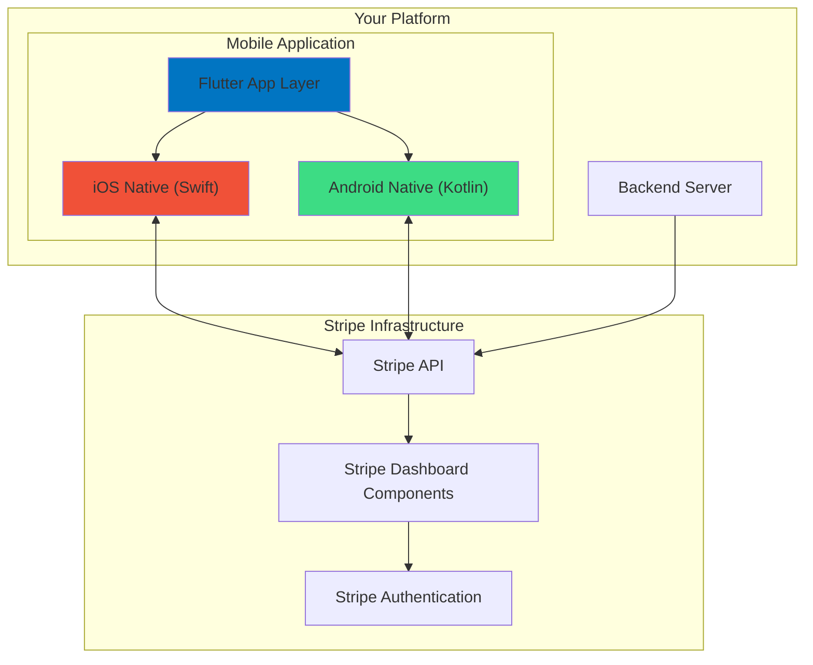
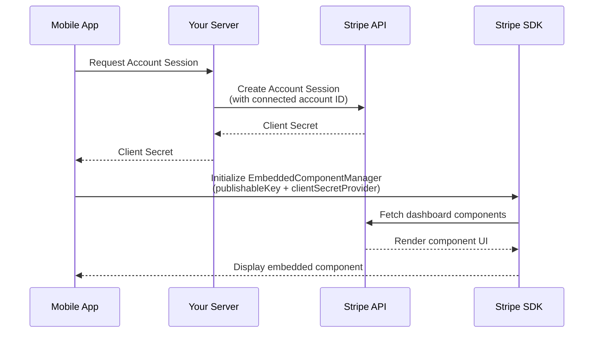
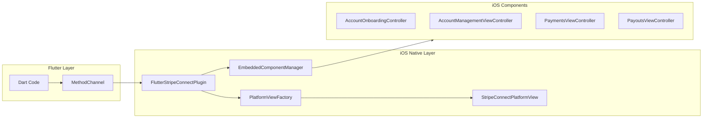
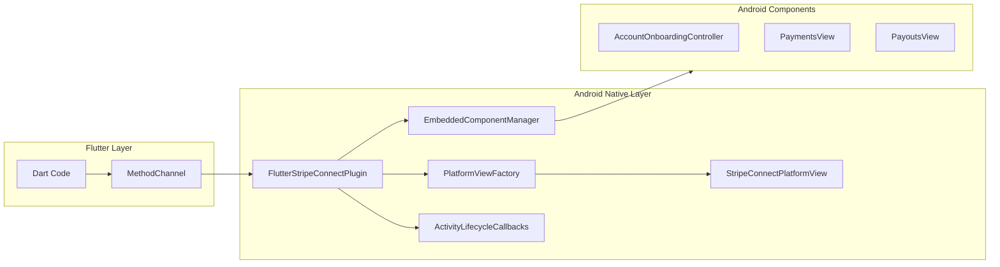
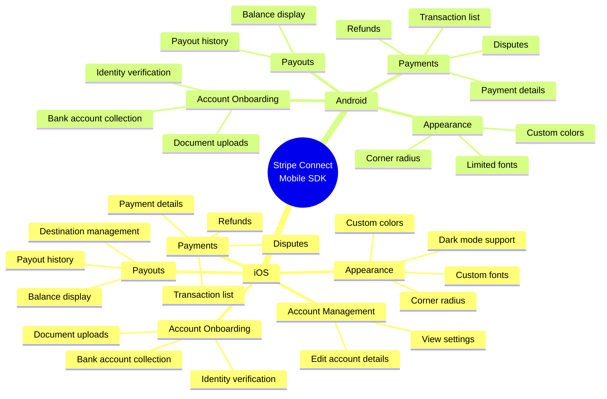
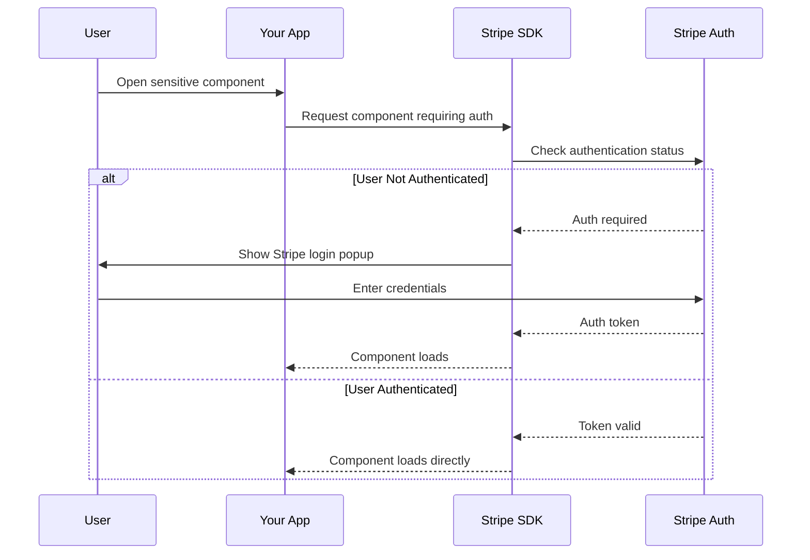
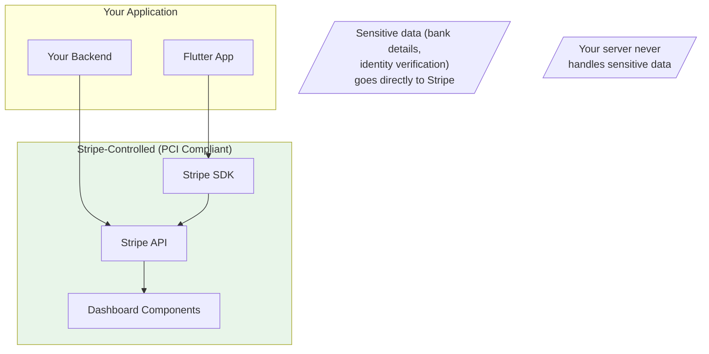
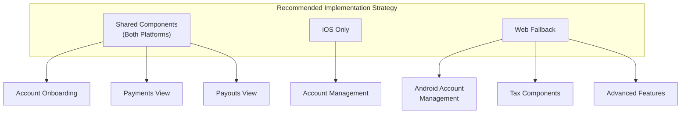

# Stripe Connect Embedded Components: iOS & Android Research Document

> A comprehensive technical analysis of Stripe Connect embedded components for native mobile platforms.

---

## Executive Summary

Stripe Connect embedded components allow platforms to integrate connected account management functionality directly into mobile applications. This document outlines how these components work on iOS and Android, their capabilities, and platform-specific limitations.

---

## Architecture Overview



---

## How Stripe Connect Embedding Works

### High-Level Flow



### Step-by-Step Process

1. **Account Session Creation** (Server-side)
   - Your backend creates an [Account Session](https://docs.stripe.com/api/account_sessions) for the connected account
   - Specifies which components are enabled (onboarding, payments, payouts, etc.)
   - Returns a `client_secret` valid for a limited time

2. **SDK Initialization** (Client-side)
   - App initializes `EmbeddedComponentManager` with:
     - Stripe publishable key
     - A callback function to fetch fresh client secrets

3. **Component Rendering**
   - SDK creates native views or controllers for each component type
   - Components communicate with Stripe servers to load/update data
   - UI is rendered natively within your app

---

## Platform Comparison

### Component Availability Matrix

| Component | iOS | Android | Web |
|:----------|:---:|:-------:|:---:|
| **Account Onboarding** | ✅ | ✅ | ✅ |
| **Account Management** | ✅ | ❌ | ✅ |
| **Payments** | ✅ | ✅ | ✅ |
| **Payouts** | ✅ | ✅ | ✅ |
| **Notification Banner** | ✅ | ⚠️ Limited | ✅ |
| **Balances** | ✅ | ⚠️ Limited | ✅ |
| **Documents** | ⚠️ Limited | ⚠️ Limited | ✅ |
| **Tax Settings** | ❌ | ❌ | ✅ |
| **Tax Registrations** | ❌ | ❌ | ✅ |

> **Legend:** ✅ Fully Supported | ⚠️ Limited/Preview | ❌ Not Supported

---

## iOS Implementation

### Architecture



### Component Types

#### 1. Account Onboarding (Modal Presentation)
- Presented as a **modal sheet** using `AccountOnboardingController`
- User completes onboarding flow and returns to app
- Supports exit callback for tracking completion

#### 2. Account Management (Embedded View)
- Rendered as an **embedded UIViewController**
- Displays account settings and details inline
- **Only available on iOS**

#### 3. Payments & Payouts (Embedded Views)
- Embedded as native UIViewControllers
- Display transaction history, balances, and details
- Support pull-to-refresh and pagination

### iOS Requirements

| Requirement | Value |
|:------------|:------|
| **Minimum iOS Version** | iOS 15.0+ |
| **Xcode Version** | Xcode 16+ |
| **Swift Version** | Swift 5.9+ |
| **StripeConnect SDK** | Via CocoaPods/SPM |

### Supported Features on iOS

- ✅ Full Account Onboarding flow
- ✅ Account Management (view/edit account details)
- ✅ Payments list with details, refunds, disputes
- ✅ Payouts list with balance information
- ✅ Customizable appearance (colors, fonts, corner radius)
- ✅ Delegate callbacks for all events
- ✅ Automatic locale handling

---

## Android Implementation

### Architecture



### Component Types

#### 1. Account Onboarding (Modal)
- Uses `AccountOnboardingController` for modal presentation
- Requires `FragmentActivity` (not regular Activity)
- Handles onDismiss callback for flow completion

#### 2. Payments & Payouts (Embedded Views)
- Created via `createPaymentsView()` and `createPayoutsView()`
- Native Android Views embedded in Flutter
- Support listener callbacks for errors

#### 3. Account Management
- **NOT AVAILABLE** on Android SDK
- Must use web fallback or redirect to Stripe Dashboard

### Android Requirements

| Requirement | Value |
|:------------|:------|
| **Minimum SDK** | API 21 (Android 5.0) |
| **Target SDK** | API 34+ (recommended) |
| **Gradle Plugin** | 8.1+ |
| **Gradle Version** | 8.0+ |
| **Kotlin Version** | 1.9+ |
| **Activity Type** | FlutterFragmentActivity |

### Critical Android Setup

```kotlin
// MainActivity MUST extend FlutterFragmentActivity
class MainActivity : FlutterFragmentActivity()

// EmbeddedComponentManager.onActivityCreate() must be called
// during Activity onCreate (handled automatically by plugin)
```

---

## Feature Comparison Deep Dive

### What's Supported



### What's NOT Supported

| Feature | iOS | Android | Workaround |
|:--------|:---:|:-------:|:-----------|
| Account Management | ✅ | ❌ | Use WebView or redirect to web |
| Custom Fonts in WebView | ✅ | ❌ | Use system fonts on Android |
| Notification Banner | ✅ | ⚠️ | Check API for pending actions |
| Tax Components | ❌ | ❌ | Use web interface |
| Documents Download | ⚠️ | ⚠️ | Use Stripe Dashboard directly |
| Capital Loans | ❌ | ❌ | Web only |
| Issuing Cards | ❌ | ❌ | Web only |

---

## Authentication Flow



### Components Requiring Authentication

Some components require users to authenticate with their Stripe account:
- Account Management (edit mode)
- Sensitive payout operations
- Dispute management

---

## Security Considerations

### Data Flow



### Key Security Points

1. **PCI Compliance**: Sensitive data is handled entirely by Stripe SDK
2. **No Server-Side Data**: Your backend only handles account IDs and client secrets
3. **Short-Lived Tokens**: Client secrets expire quickly for security
4. **Native Authentication**: Stripe handles user authentication securely

---

## Known Limitations & Workarounds

### Android-Specific Limitations

| Limitation | Impact | Workaround |
|:-----------|:-------|:-----------|
| No Account Management | Users cannot view/edit account details | Implement web-based account management |
| Custom fonts in WebView | Cannot use brand fonts in authenticated views | Use Stripe default fonts |
| Preview SDK APIs | Some components marked as preview | Monitor Stripe SDK updates |

### iOS-Specific Considerations

| Consideration | Details |
|:--------------|:--------|
| Modal presentation required for onboarding | Cannot embed directly; must present from top ViewController |
| Minimum iOS 15 | Older devices not supported |
| Preview API annotations | Some features use `@_spi(PreviewConnect)` |

### General Limitations

| Limitation | Both Platforms |
|:-----------|:---------------|
| Network dependency | Components require active internet |
| WebView-based | Some components render web content |
| Limited offline support | No offline mode available |
| Stripe branding | Cannot fully remove Stripe branding |

---

## Recommendations for Client

### For iOS App

1. **Full Suite Available**: Can implement all major components natively
2. **Target iOS 15+**: Ensure deployment target is set correctly
3. **Use all components**: Account Onboarding, Management, Payments, Payouts

### For Android App

1. **Account Management Gap**: Must implement alternative solution
   - **Option A**: WebView integration for account management
   - **Option B**: Deep link to Stripe Express Dashboard
   - **Option C**: Skip account management on mobile (web only)
   
2. **FragmentActivity Required**: MainActivity must extend `FlutterFragmentActivity`

3. **Available Components**: Can use Onboarding, Payments, and Payouts

### Cross-Platform Strategy



---

## Summary

| Aspect | iOS | Android |
|:-------|:----|:--------|
| **Maturity** | More mature | Still evolving |
| **Component Coverage** | Complete | Missing Account Management |
| **Customization** | Full | Limited fonts in WebView |
| **Integration Complexity** | Standard | Requires FragmentActivity setup |
| **Recommendation** | Use all features | Implement web fallback for gaps |

---

## References

- [Stripe Connect Embedded Components](https://docs.stripe.com/connect/supported-embedded-components)
- [Stripe iOS SDK](https://github.com/stripe/stripe-ios)
- [Stripe Android SDK](https://github.com/stripe/stripe-android)
- [Account Sessions API](https://docs.stripe.com/api/account_sessions)

---

*Document prepared for client review - December 2024*
