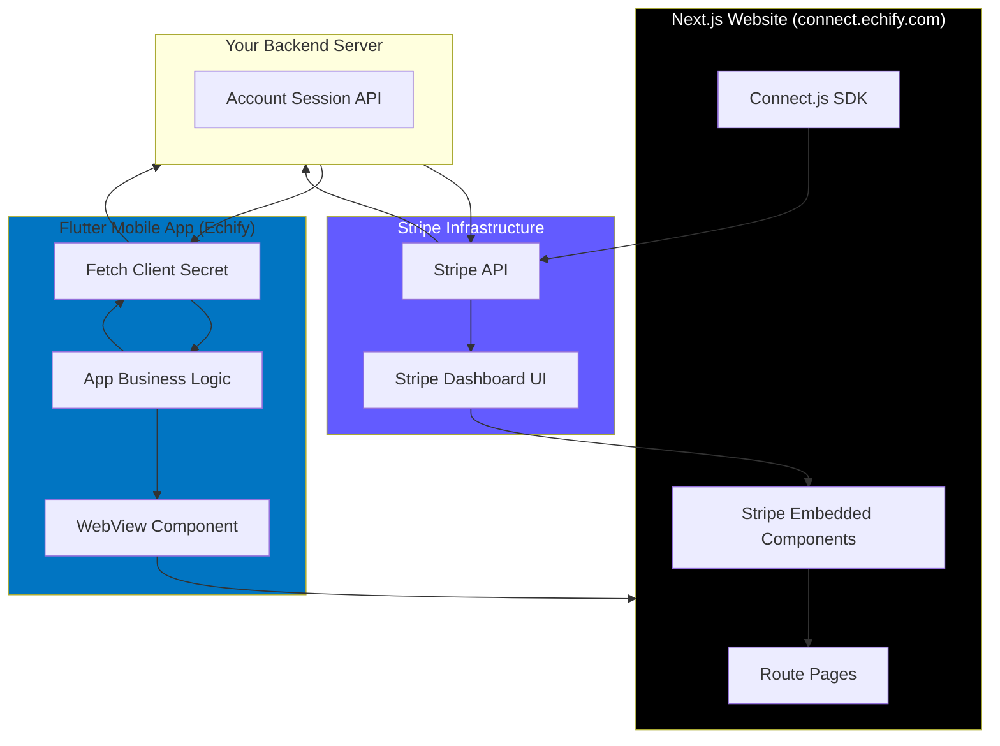
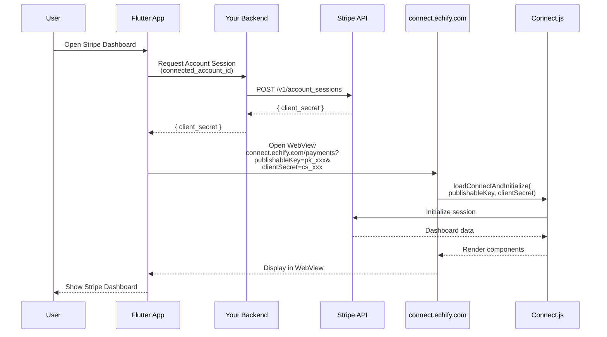
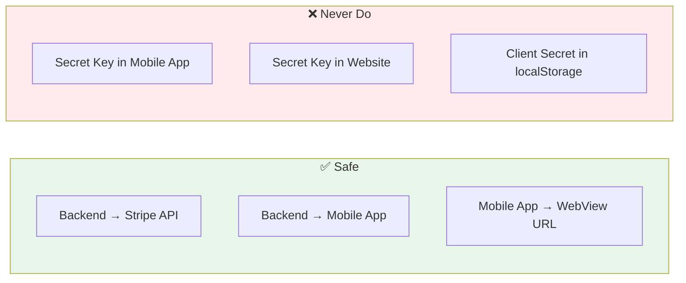

# Stripe Connect WebView Integration Guide

> A comprehensive guide for embedding Stripe Connect components in a Next.js website and displaying them in a Flutter mobile app via WebView.

---

## Executive Summary

This document outlines a **hybrid approach** to Stripe Connect integration where:

1. A **Next.js website** (`connect.echify.com`) hosts Stripe Connect embedded components
2. The **Flutter mobile app** displays this website in a WebView
3. URL parameters (`publishableKey`, `clientSecret`) enable secure initialization

This approach provides **full component availability** (unlike native SDKs which have platform limitations) while maintaining a seamless mobile experience.

---

## Architecture Overview



---

## Communication Flow



---

## Advantages of WebView Approach

| Aspect | Native SDK | WebView Approach |
|:-------|:-----------|:-----------------|
| **Account Management** | iOS only, Not on Android | ✅ Available everywhere |
| **Tax Components** | ❌ Not available | ✅ Available |
| **Capital/Loans** | ❌ Not available | ✅ Available |
| **Documents** | Limited | ✅ Full support |
| **Component Parity** | Platform-dependent | ✅ Consistent across all platforms |
| **Update Frequency** | Requires app update | ✅ Website-side updates |
| **Maintenance** | Two codebases (iOS/Android) | ✅ Single codebase |
| **Customization** | Limited | ✅ Full CSS control |

---

## Available Components (Web)

All **25 embedded components** are available when using the web-based approach:

### Onboarding & Compliance
| Component | Code Name | Description |
|:----------|:----------|:------------|
| Account Management | `account-management` | View and edit account details |
| Account Onboarding | `account-onboarding` | Complete account onboarding flow |
| Notification Banner | `notification-banner` | Show pending actions/requirements |

### Payments
| Component | Code Name | Description |
|:----------|:----------|:------------|
| Payments | `payments` | List of all payments with filters |
| Payment Details | `payment-details` | Individual payment details |
| Payment Method Settings | `payment-method-settings` | Configure payment methods |
| Disputes for a Payment | `disputes-for-a-payment` | Dispute for specific payment |
| Disputes List | `disputes-list` | List of all disputes |

### Payouts
| Component | Code Name | Description |
|:----------|:----------|:------------|
| Payouts | `payouts` | Payouts dashboard with all functionality |
| Payout Details | `payout-details` | Individual payout details |
| Payouts List | `payouts-list` | List of all payouts |
| Balances | `balances` | Account balance display |
| Instant Payouts Promotion | `instant-payouts-promotion` | Promote instant payouts feature |
| Recipients | `recipients` | Manage payout recipients |

### Capital (Web Only)
| Component | Code Name | Description |
|:----------|:----------|:------------|
| Capital Financing | `capital-financing` | Manage loans and financing |
| Capital Financing Application | `capital-financing-application` | Apply for financing |
| Capital Financing Promotion | `capital-financing-promotion` | Promote capital financing |

### Tax (Web Only)
| Component | Code Name | Description |
|:----------|:----------|:------------|
| Tax Registrations | `tax-registrations` | Manage tax registrations |
| Tax Settings | `tax-settings` | Configure tax settings |

### Financial Services / Issuing (Web Only)
| Component | Code Name | Description |
|:----------|:----------|:------------|
| Financial Account | `financial-account` | Treasury financial account |
| Financial Account Transactions | `financial-account-transactions` | Treasury transaction history |
| Issuing Card | `issuing-card` | Manage individual issued card |
| Issuing Cards List | `issuing-cards-list` | List of all issued cards |

### Reporting
| Component | Code Name | Description |
|:----------|:----------|:------------|
| Documents | `documents` | Download tax documents, 1099s, etc. |
| Reporting Chart | `reporting-chart` | Financial reporting charts |

---

## Implementation Details

### Part 1: Next.js Website (connect.echify.com)

#### Project Structure

```
connect.echify.com/
├── app/
│   ├── layout.tsx                  # Root layout with providers
│   ├── page.tsx                    # Landing/redirect page
│   │
│   # Onboarding & Compliance
│   ├── onboarding/page.tsx         # account-onboarding
│   ├── account/page.tsx            # account-management
│   ├── notifications/page.tsx      # notification-banner
│   │
│   # Payments
│   ├── payments/page.tsx           # payments
│   ├── payment-details/page.tsx    # payment-details
│   ├── payment-methods/page.tsx    # payment-method-settings
│   ├── disputes/page.tsx           # disputes-list
│   ├── dispute/page.tsx            # disputes-for-a-payment
│   │
│   # Payouts
│   ├── payouts/page.tsx            # payouts
│   ├── payout-details/page.tsx     # payout-details
│   ├── payouts-list/page.tsx       # payouts-list
│   ├── balances/page.tsx           # balances
│   ├── instant-payouts/page.tsx    # instant-payouts-promotion
│   ├── recipients/page.tsx         # recipients
│   │
│   # Capital
│   ├── capital/page.tsx            # capital-financing
│   ├── capital-apply/page.tsx      # capital-financing-application
│   ├── capital-promo/page.tsx      # capital-financing-promotion
│   │
│   # Tax
│   ├── tax-registrations/page.tsx  # tax-registrations
│   ├── tax-settings/page.tsx       # tax-settings
│   │
│   # Financial Services / Issuing
│   ├── financial-account/page.tsx  # financial-account
│   ├── financial-txns/page.tsx     # financial-account-transactions
│   ├── issuing-card/page.tsx       # issuing-card
│   ├── issuing-cards/page.tsx      # issuing-cards-list
│   │
│   # Reporting
│   ├── documents/page.tsx          # documents
│   └── reporting/page.tsx          # reporting-chart
│
├── components/
│   ├── StripeConnectProvider.tsx   # Context provider
│   └── StripeConnectComponent.tsx  # Reusable wrapper
├── hooks/
│   └── useStripeConnect.ts         # Custom hook
├── lib/
│   └── stripe.ts                   # Stripe utilities
└── styles/
    └── globals.css
```

#### Step 1: Install Dependencies

```bash
npm install @stripe/connect-js
# or
pnpm add @stripe/connect-js
```

#### Step 2: Create Stripe Connect Provider

```tsx
// components/StripeConnectProvider.tsx
'use client';

import { createContext, useContext, useEffect, useState, ReactNode } from 'react';
import { loadConnectAndInitialize, StripeConnectInstance } from '@stripe/connect-js';

interface StripeConnectContextValue {
  stripeConnectInstance: StripeConnectInstance | null;
  isLoading: boolean;
  error: string | null;
}

const StripeConnectContext = createContext<StripeConnectContextValue>({
  stripeConnectInstance: null,
  isLoading: true,
  error: null,
});

interface StripeConnectProviderProps {
  children: ReactNode;
  publishableKey: string;
  clientSecret: string;
  appearance?: {
    overlays?: 'dialog' | 'drawer';
    variables?: {
      colorPrimary?: string;
      colorBackground?: string;
      colorText?: string;
      colorDanger?: string;
      fontFamily?: string;
      fontSizeBase?: string;
      spacingUnit?: string;
      borderRadius?: string;
    };
  };
}

export function StripeConnectProvider({
  children,
  publishableKey,
  clientSecret,
  appearance,
}: StripeConnectProviderProps) {
  const [stripeConnectInstance, setStripeConnectInstance] = useState<StripeConnectInstance | null>(null);
  const [isLoading, setIsLoading] = useState(true);
  const [error, setError] = useState<string | null>(null);

  useEffect(() => {
    if (!publishableKey || !clientSecret) {
      setError('Missing publishableKey or clientSecret');
      setIsLoading(false);
      return;
    }

    const initStripe = async () => {
      try {
        const instance = loadConnectAndInitialize({
          publishableKey,
          fetchClientSecret: async () => clientSecret,
          appearance: appearance || {
            overlays: 'dialog',
            variables: {
              colorPrimary: '#635BFF',
            },
          },
        });
        
        setStripeConnectInstance(instance);
        setIsLoading(false);
      } catch (err) {
        setError(err instanceof Error ? err.message : 'Failed to initialize Stripe');
        setIsLoading(false);
      }
    };

    initStripe();
  }, [publishableKey, clientSecret, appearance]);

  return (
    <StripeConnectContext.Provider value={{ stripeConnectInstance, isLoading, error }}>
      {children}
    </StripeConnectContext.Provider>
  );
}

export function useStripeConnect() {
  const context = useContext(StripeConnectContext);
  if (!context) {
    throw new Error('useStripeConnect must be used within StripeConnectProvider');
  }
  return context;
}
```

#### Step 3: Create Root Layout with URL Parameter Handling

```tsx
// app/layout.tsx
'use client';

import { useSearchParams } from 'next/navigation';
import { Suspense } from 'react';
import { StripeConnectProvider } from '@/components/StripeConnectProvider';
import './globals.css';

function StripeWrapper({ children }: { children: React.ReactNode }) {
  const searchParams = useSearchParams();
  
  const publishableKey = searchParams.get('publishableKey') || '';
  const clientSecret = searchParams.get('clientSecret') || '';
  
  // Optional: Get theme from URL
  const theme = searchParams.get('theme') || 'light';
  const primaryColor = searchParams.get('primaryColor') || '#635BFF';
  
  if (!publishableKey || !clientSecret) {
    return (
      <div className="error-container">
        <h1>Missing Parameters</h1>
        <p>Required: publishableKey and clientSecret</p>
      </div>
    );
  }

  return (
    <StripeConnectProvider
      publishableKey={publishableKey}
      clientSecret={clientSecret}
      appearance={{
        overlays: 'dialog',
        variables: {
          colorPrimary: primaryColor,
          colorBackground: theme === 'dark' ? '#1a1a1a' : '#ffffff',
          colorText: theme === 'dark' ? '#ffffff' : '#1a1a1a',
        },
      }}
    >
      {children}
    </StripeConnectProvider>
  );
}

export default function RootLayout({
  children,
}: {
  children: React.ReactNode;
}) {
  return (
    <html lang="en">
      <body>
        <Suspense fallback={<div>Loading...</div>}>
          <StripeWrapper>
            {children}
          </StripeWrapper>
        </Suspense>
      </body>
    </html>
  );
}
```

#### Step 4: Create Component Pages

##### Payments Page
```tsx
// app/payments/page.tsx
'use client';

import { useEffect, useRef } from 'react';
import { useStripeConnect } from '@/components/StripeConnectProvider';

export default function PaymentsPage() {
  const { stripeConnectInstance, isLoading, error } = useStripeConnect();
  const containerRef = useRef<HTMLDivElement>(null);

  useEffect(() => {
    if (stripeConnectInstance && containerRef.current) {
      const paymentComponent = stripeConnectInstance.create('payments');
      containerRef.current.appendChild(paymentComponent);
      
      return () => {
        if (containerRef.current) {
          containerRef.current.innerHTML = '';
        }
      };
    }
  }, [stripeConnectInstance]);

  if (isLoading) {
    return <div className="loading">Loading payments...</div>;
  }

  if (error) {
    return <div className="error">{error}</div>;
  }

  return (
    <div className="component-container">
      <div ref={containerRef} className="stripe-component" />
    </div>
  );
}
```

##### Account Onboarding Page
```tsx
// app/onboarding/page.tsx
'use client';

import { useEffect, useRef } from 'react';
import { useStripeConnect } from '@/components/StripeConnectProvider';

export default function OnboardingPage() {
  const { stripeConnectInstance, isLoading, error } = useStripeConnect();
  const containerRef = useRef<HTMLDivElement>(null);

  useEffect(() => {
    if (stripeConnectInstance && containerRef.current) {
      const onboardingComponent = stripeConnectInstance.create('account-onboarding');
      
      // Handle onboarding exit
      onboardingComponent.setOnExit(() => {
        // Notify Flutter app via postMessage
        window.parent.postMessage({ type: 'ONBOARDING_EXIT' }, '*');
      });
      
      containerRef.current.appendChild(onboardingComponent);
      
      return () => {
        if (containerRef.current) {
          containerRef.current.innerHTML = '';
        }
      };
    }
  }, [stripeConnectInstance]);

  if (isLoading) {
    return <div className="loading">Loading onboarding...</div>;
  }

  if (error) {
    return <div className="error">{error}</div>;
  }

  return (
    <div className="component-container">
      <div ref={containerRef} className="stripe-component" />
    </div>
  );
}
```

##### Account Management Page
```tsx
// app/account/page.tsx
'use client';

import { useEffect, useRef } from 'react';
import { useStripeConnect } from '@/components/StripeConnectProvider';

export default function AccountPage() {
  const { stripeConnectInstance, isLoading, error } = useStripeConnect();
  const containerRef = useRef<HTMLDivElement>(null);

  useEffect(() => {
    if (stripeConnectInstance && containerRef.current) {
      const accountComponent = stripeConnectInstance.create('account-management');
      containerRef.current.appendChild(accountComponent);
      
      return () => {
        if (containerRef.current) {
          containerRef.current.innerHTML = '';
        }
      };
    }
  }, [stripeConnectInstance]);

  if (isLoading) {
    return <div className="loading">Loading account...</div>;
  }

  if (error) {
    return <div className="error">{error}</div>;
  }

  return (
    <div className="component-container">
      <div ref={containerRef} className="stripe-component" />
    </div>
  );
}
```

##### Payouts Page
```tsx
// app/payouts/page.tsx
'use client';

import { useEffect, useRef } from 'react';
import { useStripeConnect } from '@/components/StripeConnectProvider';

export default function PayoutsPage() {
  const { stripeConnectInstance, isLoading, error } = useStripeConnect();
  const containerRef = useRef<HTMLDivElement>(null);

  useEffect(() => {
    if (stripeConnectInstance && containerRef.current) {
      const payoutsComponent = stripeConnectInstance.create('payouts');
      containerRef.current.appendChild(payoutsComponent);
      
      return () => {
        if (containerRef.current) {
          containerRef.current.innerHTML = '';
        }
      };
    }
  }, [stripeConnectInstance]);

  if (isLoading) {
    return <div className="loading">Loading payouts...</div>;
  }

  if (error) {
    return <div className="error">{error}</div>;
  }

  return (
    <div className="component-container">
      <div ref={containerRef} className="stripe-component" />
    </div>
  );
}
```

#### Step 5: Global Styles

```css
/* styles/globals.css */
* {
  margin: 0;
  padding: 0;
  box-sizing: border-box;
}

html, body {
  height: 100%;
  width: 100%;
  overflow: hidden;
}

.component-container {
  width: 100%;
  height: 100vh;
  display: flex;
  flex-direction: column;
}

.stripe-component {
  flex: 1;
  width: 100%;
  min-height: 100vh;
}

.loading {
  display: flex;
  justify-content: center;
  align-items: center;
  height: 100vh;
  font-size: 16px;
  color: #666;
}

.error {
  display: flex;
  justify-content: center;
  align-items: center;
  height: 100vh;
  font-size: 16px;
  color: #dc3545;
  padding: 20px;
  text-align: center;
}

.error-container {
  display: flex;
  flex-direction: column;
  justify-content: center;
  align-items: center;
  height: 100vh;
  text-align: center;
  padding: 20px;
}

.error-container h1 {
  color: #dc3545;
  margin-bottom: 10px;
}
```

---

### Part 2: Flutter Mobile App Integration

#### Step 1: Add WebView Dependency

```yaml
# pubspec.yaml
dependencies:
  flutter:
    sdk: flutter
  webview_flutter: ^4.4.2
  # For iOS
  webview_flutter_wkwebview: ^3.9.0
  # For Android
  webview_flutter_android: ^3.12.0
```

#### Step 2: Create Stripe Connect WebView Widget

```dart
// lib/stripe_connect_webview.dart
import 'package:flutter/material.dart';
import 'package:webview_flutter/webview_flutter.dart';

enum StripeConnectComponent {
  // Onboarding & Compliance
  accountManagement,
  accountOnboarding,
  notificationBanner,
  
  // Payments
  payments,
  paymentDetails,
  paymentMethodSettings,
  disputesForPayment,
  disputesList,
  
  // Payouts
  payouts,
  payoutDetails,
  payoutsList,
  balances,
  instantPayoutsPromotion,
  recipients,
  
  // Capital
  capitalFinancing,
  capitalFinancingApplication,
  capitalFinancingPromotion,
  
  // Tax
  taxRegistrations,
  taxSettings,
  
  // Financial Services / Issuing
  financialAccount,
  financialAccountTransactions,
  issuingCard,
  issuingCardsList,
  
  // Reporting
  documents,
  reportingChart,
}

class StripeConnectWebView extends StatefulWidget {
  final String publishableKey;
  final String clientSecret;
  final StripeConnectComponent component;
  final String? theme;
  final String? primaryColor;
  final VoidCallback? onExit;
  final VoidCallback? onLoadComplete;
  final Function(String)? onError;

  const StripeConnectWebView({
    super.key,
    required this.publishableKey,
    required this.clientSecret,
    required this.component,
    this.theme,
    this.primaryColor,
    this.onExit,
    this.onLoadComplete,
    this.onError,
  });

  @override
  State<StripeConnectWebView> createState() => _StripeConnectWebViewState();
}

class _StripeConnectWebViewState extends State<StripeConnectWebView> {
  late final WebViewController _controller;
  bool _isLoading = true;

  @override
  void initState() {
    super.initState();
    _initWebView();
  }

  void _initWebView() {
    _controller = WebViewController()
      ..setJavaScriptMode(JavaScriptMode.unrestricted)
      ..setBackgroundColor(Colors.white)
      ..setNavigationDelegate(
        NavigationDelegate(
          onPageStarted: (url) {
            setState(() => _isLoading = true);
          },
          onPageFinished: (url) {
            setState(() => _isLoading = false);
            widget.onLoadComplete?.call();
          },
          onWebResourceError: (error) {
            widget.onError?.call(error.description);
          },
        ),
      )
      ..addJavaScriptChannel(
        'FlutterChannel',
        onMessageReceived: (message) {
          _handleMessage(message.message);
        },
      )
      ..loadRequest(Uri.parse(_buildUrl()));
  }

  String _buildUrl() {
    final baseUrl = 'https://connect.echify.com';
    final path = _getComponentPath();
    
    final params = {
      'publishableKey': widget.publishableKey,
      'clientSecret': widget.clientSecret,
      if (widget.theme != null) 'theme': widget.theme!,
      if (widget.primaryColor != null) 'primaryColor': widget.primaryColor!,
    };
    
    final queryString = params.entries
        .map((e) => '${e.key}=${Uri.encodeComponent(e.value)}')
        .join('&');
    
    return '$baseUrl$path?$queryString';
  }

  String _getComponentPath() {
    switch (widget.component) {
      // Onboarding & Compliance
      case StripeConnectComponent.accountManagement:
        return '/account';
      case StripeConnectComponent.accountOnboarding:
        return '/onboarding';
      case StripeConnectComponent.notificationBanner:
        return '/notifications';
      
      // Payments
      case StripeConnectComponent.payments:
        return '/payments';
      case StripeConnectComponent.paymentDetails:
        return '/payment-details';
      case StripeConnectComponent.paymentMethodSettings:
        return '/payment-methods';
      case StripeConnectComponent.disputesForPayment:
        return '/dispute';
      case StripeConnectComponent.disputesList:
        return '/disputes';
      
      // Payouts
      case StripeConnectComponent.payouts:
        return '/payouts';
      case StripeConnectComponent.payoutDetails:
        return '/payout-details';
      case StripeConnectComponent.payoutsList:
        return '/payouts-list';
      case StripeConnectComponent.balances:
        return '/balances';
      case StripeConnectComponent.instantPayoutsPromotion:
        return '/instant-payouts';
      case StripeConnectComponent.recipients:
        return '/recipients';
      
      // Capital
      case StripeConnectComponent.capitalFinancing:
        return '/capital';
      case StripeConnectComponent.capitalFinancingApplication:
        return '/capital-apply';
      case StripeConnectComponent.capitalFinancingPromotion:
        return '/capital-promo';
      
      // Tax
      case StripeConnectComponent.taxRegistrations:
        return '/tax-registrations';
      case StripeConnectComponent.taxSettings:
        return '/tax-settings';
      
      // Financial Services / Issuing
      case StripeConnectComponent.financialAccount:
        return '/financial-account';
      case StripeConnectComponent.financialAccountTransactions:
        return '/financial-txns';
      case StripeConnectComponent.issuingCard:
        return '/issuing-card';
      case StripeConnectComponent.issuingCardsList:
        return '/issuing-cards';
      
      // Reporting
      case StripeConnectComponent.documents:
        return '/documents';
      case StripeConnectComponent.reportingChart:
        return '/reporting';
    }
  }

  void _handleMessage(String message) {
    // Handle messages from the web page
    if (message == 'ONBOARDING_EXIT') {
      widget.onExit?.call();
    }
    // Add more message handlers as needed
  }

  @override
  Widget build(BuildContext context) {
    return Stack(
      children: [
        WebViewWidget(controller: _controller),
        if (_isLoading)
          const Center(
            child: CircularProgressIndicator(),
          ),
      ],
    );
  }
}
```

#### Step 3: Create Service for Account Sessions

```dart
// lib/services/stripe_connect_service.dart
import 'dart:convert';
import 'package:http/http.dart' as http;

class StripeConnectService {
  final String baseUrl;
  
  StripeConnectService({required this.baseUrl});

  /// Fetches an account session from your backend
  Future<AccountSessionResponse> createAccountSession({
    required String connectedAccountId,
    required List<String> components,
  }) async {
    final response = await http.post(
      Uri.parse('$baseUrl/account-session'),
      headers: {
        'Content-Type': 'application/json',
      },
      body: jsonEncode({
        'account_id': connectedAccountId,
        'components': components,
      }),
    );

    if (response.statusCode == 200) {
      final data = jsonDecode(response.body);
      return AccountSessionResponse(
        clientSecret: data['client_secret'],
        publishableKey: data['publishable_key'],
      );
    } else {
      throw Exception('Failed to create account session: ${response.body}');
    }
  }
}

class AccountSessionResponse {
  final String clientSecret;
  final String publishableKey;

  AccountSessionResponse({
    required this.clientSecret,
    required this.publishableKey,
  });
}
```

#### Step 4: Usage Example

```dart
// lib/screens/stripe_dashboard_screen.dart
import 'package:flutter/material.dart';
import '../stripe_connect_webview.dart';
import '../services/stripe_connect_service.dart';

class StripeDashboardScreen extends StatefulWidget {
  final String connectedAccountId;

  const StripeDashboardScreen({
    super.key,
    required this.connectedAccountId,
  });

  @override
  State<StripeDashboardScreen> createState() => _StripeDashboardScreenState();
}

class _StripeDashboardScreenState extends State<StripeDashboardScreen> {
  final StripeConnectService _service = StripeConnectService(
    baseUrl: 'https://api.echify.com',
  );

  AccountSessionResponse? _session;
  bool _isLoading = true;
  String? _error;

  @override
  void initState() {
    super.initState();
    _loadAccountSession();
  }

  Future<void> _loadAccountSession() async {
    try {
      final session = await _service.createAccountSession(
        connectedAccountId: widget.connectedAccountId,
        components: ['payments', 'payouts', 'account_management'],
      );
      
      setState(() {
        _session = session;
        _isLoading = false;
      });
    } catch (e) {
      setState(() {
        _error = e.toString();
        _isLoading = false;
      });
    }
  }

  @override
  Widget build(BuildContext context) {
    if (_isLoading) {
      return const Scaffold(
        body: Center(child: CircularProgressIndicator()),
      );
    }

    if (_error != null) {
      return Scaffold(
        appBar: AppBar(title: const Text('Error')),
        body: Center(child: Text(_error!)),
      );
    }

    return Scaffold(
      appBar: AppBar(
        title: const Text('Payments'),
        leading: IconButton(
          icon: const Icon(Icons.close),
          onPressed: () => Navigator.pop(context),
        ),
      ),
      body: StripeConnectWebView(
        publishableKey: _session!.publishableKey,
        clientSecret: _session!.clientSecret,
        component: StripeConnectComponent.payments,
        theme: 'light',
        onExit: () {
          Navigator.pop(context);
        },
        onError: (error) {
          ScaffoldMessenger.of(context).showSnackBar(
            SnackBar(content: Text('Error: $error')),
          );
        },
      ),
    );
  }
}
```

#### Step 5: Tab-based Dashboard (Alternative)

```dart
// lib/screens/stripe_connect_dashboard.dart
import 'package:flutter/material.dart';
import '../stripe_connect_webview.dart';
import '../services/stripe_connect_service.dart';

class StripeConnectDashboard extends StatefulWidget {
  final String connectedAccountId;

  const StripeConnectDashboard({
    super.key,
    required this.connectedAccountId,
  });

  @override
  State<StripeConnectDashboard> createState() => _StripeConnectDashboardState();
}

class _StripeConnectDashboardState extends State<StripeConnectDashboard>
    with SingleTickerProviderStateMixin {
  late TabController _tabController;
  final StripeConnectService _service = StripeConnectService(
    baseUrl: 'https://api.echify.com',
  );

  AccountSessionResponse? _session;
  bool _isLoading = true;
  String? _error;

  final List<_TabItem> _tabs = [
    _TabItem('Payments', StripeConnectComponent.payments, Icons.payment),
    _TabItem('Payouts', StripeConnectComponent.payouts, Icons.account_balance),
    _TabItem('Account', StripeConnectComponent.account, Icons.person),
    _TabItem('Documents', StripeConnectComponent.documents, Icons.description),
  ];

  @override
  void initState() {
    super.initState();
    _tabController = TabController(length: _tabs.length, vsync: this);
    _loadAccountSession();
  }

  @override
  void dispose() {
    _tabController.dispose();
    super.dispose();
  }

  Future<void> _loadAccountSession() async {
    try {
      final session = await _service.createAccountSession(
        connectedAccountId: widget.connectedAccountId,
        components: ['payments', 'payouts', 'account_management', 'documents'],
      );

      setState(() {
        _session = session;
        _isLoading = false;
      });
    } catch (e) {
      setState(() {
        _error = e.toString();
        _isLoading = false;
      });
    }
  }

  @override
  Widget build(BuildContext context) {
    if (_isLoading) {
      return const Scaffold(
        body: Center(child: CircularProgressIndicator()),
      );
    }

    if (_error != null) {
      return Scaffold(
        appBar: AppBar(title: const Text('Error')),
        body: Center(
          child: Column(
            mainAxisAlignment: MainAxisAlignment.center,
            children: [
              Text(_error!),
              ElevatedButton(
                onPressed: _loadAccountSession,
                child: const Text('Retry'),
              ),
            ],
          ),
        ),
      );
    }

    return Scaffold(
      appBar: AppBar(
        title: const Text('Dashboard'),
        bottom: TabBar(
          controller: _tabController,
          tabs: _tabs
              .map((tab) => Tab(icon: Icon(tab.icon), text: tab.title))
              .toList(),
        ),
      ),
      body: TabBarView(
        controller: _tabController,
        children: _tabs.map((tab) {
          return StripeConnectWebView(
            publishableKey: _session!.publishableKey,
            clientSecret: _session!.clientSecret,
            component: tab.component,
            theme: 'light',
          );
        }).toList(),
      ),
    );
  }
}

class _TabItem {
  final String title;
  final StripeConnectComponent component;
  final IconData icon;

  _TabItem(this.title, this.component, this.icon);
}
```

---

### Part 3: Backend API (Node.js/Express Example)

```typescript
// server/routes/account-session.ts
import express from 'express';
import Stripe from 'stripe';

const router = express.Router();
const stripe = new Stripe(process.env.STRIPE_SECRET_KEY!);

router.post('/account-session', async (req, res) => {
  try {
    const { account_id, components } = req.body;

    if (!account_id) {
      return res.status(400).json({ error: 'account_id is required' });
    }

    // Build components configuration
    const componentsConfig: Stripe.AccountSessionCreateParams['components'] = {};

    if (components.includes('payments')) {
      componentsConfig.payments = {
        enabled: true,
        features: {
          refund_management: true,
          dispute_management: true,
          capture_payments: true,
        },
      };
    }

    if (components.includes('payouts')) {
      componentsConfig.payouts = {
        enabled: true,
        features: {
          instant_payouts: true,
          standard_payouts: true,
          edit_payout_schedule: true,
        },
      };
    }

    if (components.includes('account_management')) {
      componentsConfig.account_management = {
        enabled: true,
        features: {
          external_account_collection: true,
        },
      };
    }

    if (components.includes('account_onboarding')) {
      componentsConfig.account_onboarding = {
        enabled: true,
      };
    }

    if (components.includes('balances')) {
      componentsConfig.balances = {
        enabled: true,
        features: {
          instant_payouts: true,
          standard_payouts: true,
          edit_payout_schedule: true,
        },
      };
    }

    if (components.includes('documents')) {
      componentsConfig.documents = {
        enabled: true,
      };
    }

    if (components.includes('notification_banner')) {
      componentsConfig.notification_banner = {
        enabled: true,
        features: {
          external_account_collection: true,
        },
      };
    }

    const accountSession = await stripe.accountSessions.create({
      account: account_id,
      components: componentsConfig,
    });

    res.json({
      client_secret: accountSession.client_secret,
      publishable_key: process.env.STRIPE_PUBLISHABLE_KEY,
    });
  } catch (error) {
    console.error('Error creating account session:', error);
    res.status(500).json({
      error: error instanceof Error ? error.message : 'Unknown error',
    });
  }
});

export default router;
```

---

## URL Structure Reference

All routes use query parameters: `?publishableKey=pk_xxx&clientSecret=cs_xxx`

### Onboarding & Compliance
| Route | Component | Description |
|:------|:----------|:------------|
| `/onboarding` | `account-onboarding` | Onboarding flow |
| `/account` | `account-management` | Account settings |
| `/notifications` | `notification-banner` | Pending actions |

### Payments
| Route | Component | Description |
|:------|:----------|:------------|
| `/payments` | `payments` | Payments list |
| `/payment-details` | `payment-details` | Single payment |
| `/payment-methods` | `payment-method-settings` | Payment methods |
| `/disputes` | `disputes-list` | All disputes |
| `/dispute` | `disputes-for-a-payment` | Single dispute |

### Payouts
| Route | Component | Description |
|:------|:----------|:------------|
| `/payouts` | `payouts` | Payouts dashboard |
| `/payout-details` | `payout-details` | Single payout |
| `/payouts-list` | `payouts-list` | Payouts list |
| `/balances` | `balances` | Balance display |
| `/instant-payouts` | `instant-payouts-promotion` | Instant payouts promo |
| `/recipients` | `recipients` | Manage recipients |

### Capital
| Route | Component | Description |
|:------|:----------|:------------|
| `/capital` | `capital-financing` | Manage financing |
| `/capital-apply` | `capital-financing-application` | Apply for financing |
| `/capital-promo` | `capital-financing-promotion` | Capital promotion |

### Tax
| Route | Component | Description |
|:------|:----------|:------------|
| `/tax-registrations` | `tax-registrations` | Tax registrations |
| `/tax-settings` | `tax-settings` | Tax configuration |

### Financial Services / Issuing
| Route | Component | Description |
|:------|:----------|:------------|
| `/financial-account` | `financial-account` | Treasury account |
| `/financial-txns` | `financial-account-transactions` | Treasury transactions |
| `/issuing-card` | `issuing-card` | Single card |
| `/issuing-cards` | `issuing-cards-list` | Cards list |

### Reporting
| Route | Component | Description |
|:------|:----------|:------------|
| `/documents` | `documents` | Tax documents |
| `/reporting` | `reporting-chart` | Reporting charts |

### URL Parameters

| Parameter | Required | Description |
|:----------|:---------|:------------|
| `publishableKey` | ✅ | Stripe publishable key (`pk_live_xxx` or `pk_test_xxx`) |
| `clientSecret` | ✅ | Account Session client secret |
| `theme` | ❌ | `light` or `dark` |
| `primaryColor` | ❌ | Hex color (e.g., `#635BFF`) |

---

## Security Considerations

### 1. Client Secret Handling



### 2. Security Best Practices

| Practice | Implementation |
|:---------|:---------------|
| **Never expose secret key** | Only use publishable key on client-side |
| **HTTPS only** | Always use HTTPS for the website |
| **Short-lived tokens** | Client secrets expire; handle refresh |
| **Validate requests** | Backend should validate account ownership |
| **CSP headers** | Configure Content-Security-Policy properly |

### 3. Required CSP Headers (Next.js)

```javascript
// next.config.js
const securityHeaders = [
  {
    key: 'Content-Security-Policy',
    value: [
      "default-src 'self'",
      "script-src 'self' 'unsafe-inline' 'unsafe-eval' https://js.stripe.com https://connect-js.stripe.com",
      "style-src 'self' 'unsafe-inline' https://fonts.googleapis.com",
      "font-src 'self' https://fonts.gstatic.com",
      "frame-src 'self' https://js.stripe.com https://connect-js.stripe.com https://hooks.stripe.com",
      "connect-src 'self' https://api.stripe.com https://connect-js.stripe.com",
      "img-src 'self' data: https://*.stripe.com",
    ].join('; '),
  },
];

module.exports = {
  async headers() {
    return [
      {
        source: '/(.*)',
        headers: securityHeaders,
      },
    ];
  },
};
```

---

## Platform-Specific Configuration

### iOS (WebView)

Add to `ios/Runner/Info.plist`:

```xml
<key>NSAppTransportSecurity</key>
<dict>
    <key>NSAllowsArbitraryLoads</key>
    <false/>
    <key>NSExceptionDomains</key>
    <dict>
        <key>stripe.com</key>
        <dict>
            <key>NSIncludesSubdomains</key>
            <true/>
            <key>NSExceptionAllowsInsecureHTTPLoads</key>
            <false/>
        </dict>
    </dict>
</dict>
```

### Android (WebView)

Add to `android/app/src/main/AndroidManifest.xml`:

```xml
<uses-permission android:name="android.permission.INTERNET" />

<application
    android:usesCleartextTraffic="false"
    ...>
    <!-- Additional configuration -->
</application>
```

---

## Testing Checklist

### Website Testing

- [ ] All component pages load correctly
- [ ] URL parameters are parsed properly
- [ ] Missing parameters show error message
- [ ] Components render in both light/dark themes
- [ ] Custom colors apply correctly
- [ ] Responsive design works on mobile viewport
- [ ] CSP headers don't block Stripe resources

### Mobile App Testing

- [ ] WebView loads correctly on iOS
- [ ] WebView loads correctly on Android
- [ ] Account session creation works
- [ ] Loading states display properly
- [ ] Error handling works gracefully
- [ ] Back navigation works correctly
- [ ] Tab switching maintains session

### Integration Testing

- [ ] End-to-end flow: App → Backend → Stripe → Website → WebView
- [ ] Session refresh on long sessions
- [ ] Authentication popups work in WebView
- [ ] Document downloads work
- [ ] Onboarding completion callbacks

---

## Deployment Checklist

### Next.js Website

1. [ ] Configure environment variables
   - `NEXT_PUBLIC_STRIPE_PUBLISHABLE_KEY`
2. [ ] Set up CSP headers
3. [ ] Configure CORS if needed
4. [ ] Deploy to hosting (Vercel recommended)
5. [ ] Configure custom domain (`connect.echify.com`)
6. [ ] Enable HTTPS (automatic with Vercel)

### Backend

1. [ ] Store `STRIPE_SECRET_KEY` securely
2. [ ] Set up proper authentication
3. [ ] Implement rate limiting
4. [ ] Enable CORS for mobile app origins
5. [ ] Set up logging and monitoring

### Mobile App

1. [ ] Test WebView on all target devices
2. [ ] Handle network errors gracefully
3. [ ] Implement proper back navigation
4. [ ] Test with both test and live mode keys

---

## Summary

This WebView-based approach provides:

1. **Full Component Access** - All Stripe Connect components available
2. **Platform Parity** - Same experience on iOS and Android
3. **Easy Updates** - Website changes don't require app updates
4. **Native Feel** - WebView brings components to your app
5. **Secure Implementation** - Client secrets handled properly

The trade-off is slightly less native performance compared to SDK approach, but the benefits of full feature availability and single codebase maintenance make this the recommended approach for comprehensive Stripe Connect integration.

---

## References

- [Stripe Connect Embedded Components Docs](https://docs.stripe.com/connect/get-started-connect-embedded-components)
- [Supported Components List](https://docs.stripe.com/connect/supported-embedded-components)
- [Account Sessions API](https://docs.stripe.com/api/account_sessions)
- [Connect.js npm Package](https://github.com/stripe/connect-js)
- [Appearance Customization](https://docs.stripe.com/connect/customize-connect-embedded-components)

---
